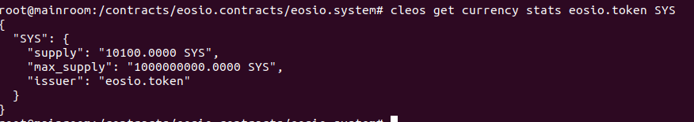
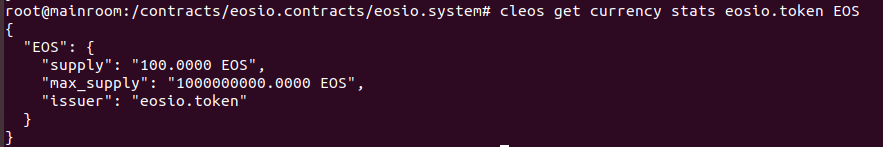
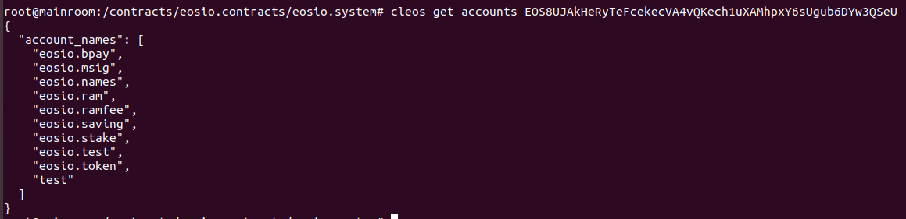
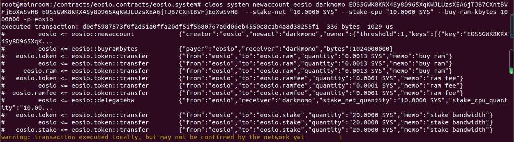
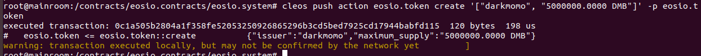
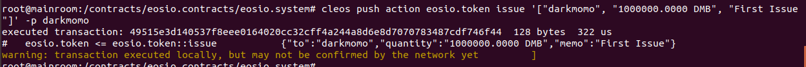
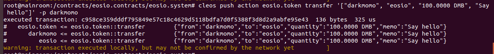

1. 创建系统token：SYS、EOS到eosio.token下

2. 创建的系统账户：eosio.stake、eosio.saving、eosio.ramfee、eosio.ram、eosio.names、eosio.msig、eosio.bpay

3. 使用EOS的system合约创建账户，并且分配RAM，CPU资源

4. 创建自己的token，token名称、数量可以自己定义，并且尝试向其他账户转账

