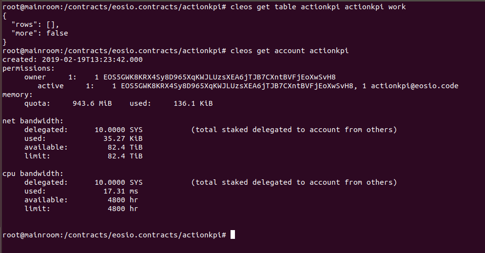
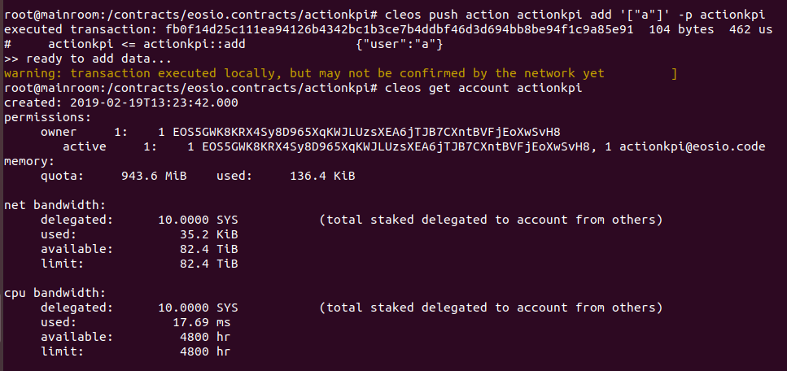
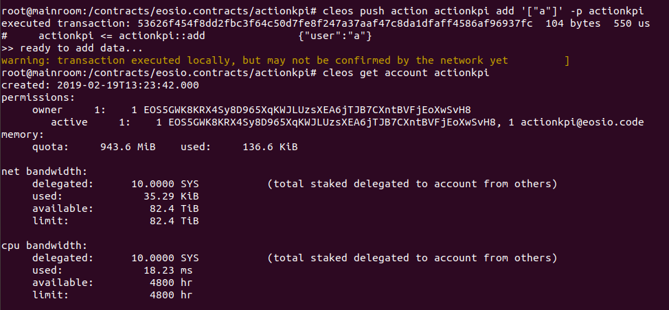

1. 合约代码
```
#include <eosiolib/eosio.hpp>
#include <eosiolib/print.hpp>
#include <eosiolib/asset.hpp>
#include <eosiolib/action.hpp>
#include <eosiolib/symbol.hpp>
#include <eosiolib/dispatcher.hpp>

using namespace eosio;
using namespace std;
class  [[eosio::contract]] actionkpi : public eosio::contract {
    public:
        using contract::contract;

        [[eosio::action]]
        // 通过kpi获取奖励
        void getbonous(name user, uint64_t kpi) {
            print("ready to record kpi...");

            require_auth(_self);
            //记录用户信息
            work_index works(_self, _self.value);
            works.emplace(
                _self,
                [&](auto& u) {
                    u.id = works.available_primary_key();
                    u.worker = user;
                    u.token = asset(kpi * 10 * 10000, symbol("EOS", 4));
                    u.score = kpi;
                }
            );

            //发放 token
            action(
                permission_level{name("eosio.token"), name("active")},
                name("eosio.token"), 
                name("transfer"),
                std::make_tuple(
                    name("eosio.token"), 
                    user, 
                    asset(kpi * 10 * 10000, symbol("EOS", 4)),
                    std::string("send eos according kpi")) 
            ).send();

            print("kpi recorded & bonous EOS sent...");
        }

        [[eosio::action]]
        //增加记录
        void add(name user) {
            print("ready to add data...");
            require_auth(_self);
            work_index works(_self, _self.value);
            works.emplace(
                _self,
                [&](auto& u) {
                    u.id = works.available_primary_key();
                    u.worker = user;
                    u.token = asset(0, symbol("EOS", 4));
                    u.score = 0;
                }
            );
        }

        [[eosio::action]]
        //删除记录
        void del(uint64_t id) {
            print("ready to delete data...");
            work_index works(_self, _self.value);
            auto iterator = works.find(id);
            works.erase(iterator);
        }

        struct [[eosio::table]] work{
            uint64_t id;
            name worker;
            asset token;
            uint64_t score;
            uint64_t creat_time= current_time();
            //主键
            uint64_t primary_key() const {  return id; }


            //序列化数据。
            EOSLIB_SERIALIZE( work, (id)(worker)(token)(score)(creat_time))
        };

        typedef eosio::multi_index<
            name("work"),
            work        
        > work_index;
};


#define EOSIO_DISPATCH_CUSTOM(TYPE, MEMBERS) \
extern "C" { \
   void apply( uint64_t receiver, uint64_t code, uint64_t action ) { \
   auto self = receiver; \
      if(( code == self&&action != name("transfer").value) ) { \
        switch( action ) { \
            EOSIO_DISPATCH_HELPER( TYPE, MEMBERS ) \
         } \
         /* does not allow destructor of this contract to run: eosio_exit(0); */ \
      } \
   } \
} \


EOSIO_DISPATCH_CUSTOM(actionkpi, (getbonous)(add)(del))
```

2. 账户初始状态



3. 添加一条数据后



ram的数值由 136.1k -> 136.4k，消耗了0.3k

4. 添加第二条数据后


ram的数值由 136.4k -> 136.6k，消耗了0.2k

平均下来每条数据 0.25k

5. 删除所有数据后，ram恢复到了136.1k

思考：

每条数据 ram 消耗的多少与 table 的 struct 中定义的属性数量有关