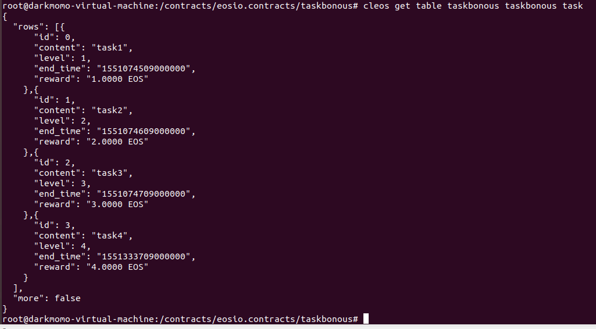
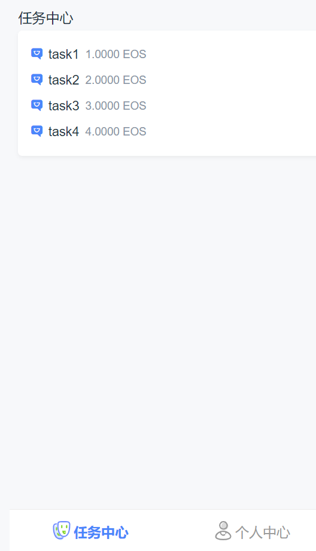
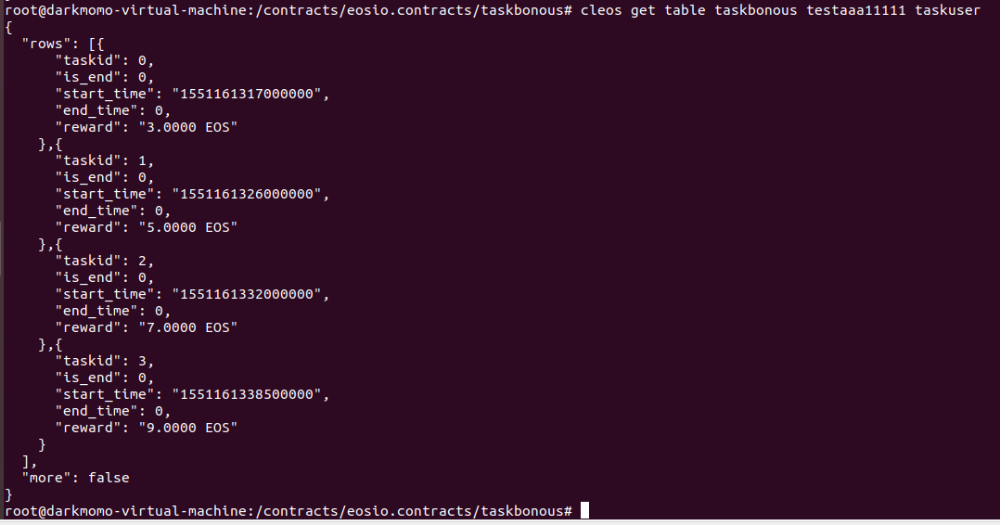
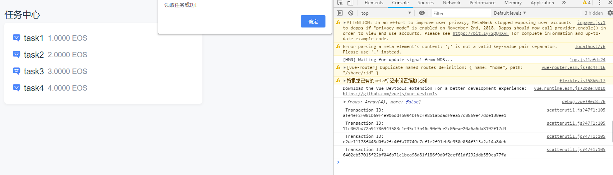
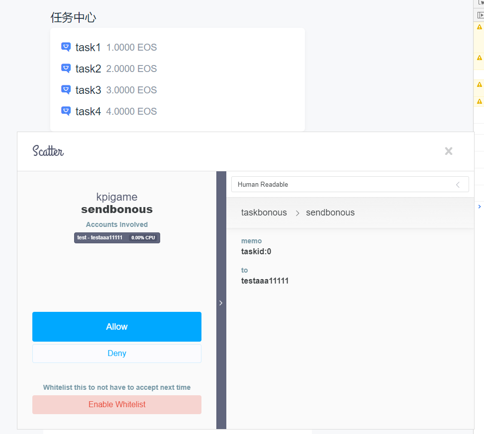
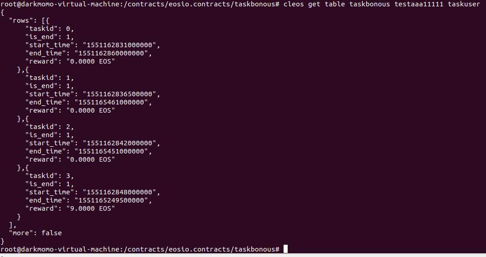

1. 发布 4 个任务，并在页面显示出来



2. 用户 testaaa11111 通过页面认领4个任务



3. 用户 testaaa11111 提交任务到合约


4. 合约根据提交日期判断需要发放给用户多少token奖励
4个任务中前3个已超时，所以不发奖励；第4个任务发送奖励给用户 testaaa11111


5. 发送奖励需要设置权限

因为是从 `taskbonous` 合约账户转出代币，所以需要`taskbonous@owner`给`taskbonous@eosio.code`授权：
```
cleos set account permission taskbonous active '{"threshold": 1, "keys": [{"key": "EOS62Axert6XPVAvfscAWj3jEZgD8EJkrVTeWwAC3pX4F2p2C734H", "weight": 1}], "accounts": [{"permission": {"actor": "taskbonous", "permission": "eosio.code"},"weight": 1}]}' owner -p taskbonous
```

经检查，`testaaa11111`账户`EOS`余额确实增加了。

7. 主要完成的代码在`taskbonous.cpp`以及`scatterutil.js`中